# Agent Lab

A progressive hands-on journey through LLM application development — from raw OpenAI API calls to multi-agent LangGraph workflows.

```mermaid
flowchart LR
    subgraph Lab1["01 — OpenAI Basics"]
        O1["recipe_generator<br/><i>JSON structured output</i>"]
        O2["trip_planner<br/><i>Prompt engineering</i>"]
        O3["ticket_classifier<br/><i>Few-shot + JSON mode</i>"]
    end
    subgraph Lab2["02 — LangChain + Pydantic"]
        L1["ticket_router<br/><i>ChatPromptTemplate</i>"]
        L2["product_tagger<br/><i>Pydantic validation</i>"]
        L3["customs_manifest_analyzer<br/><i>Nested Pydantic models</i>"]
    end
    subgraph Lab3["03 — RAG + Chroma DB"]
        R1["customs_rag<br/><i>Text splitting + retrieval</i>"]
        R2["baggage_routing_rag<br/><i>RunnableParallel</i>"]
        R3["biodome_inspection_rag<br/><i>Discriminated unions</i>"]
    end
    subgraph Lab4["04 — LangGraph Agents"]
        G1["code_generator_agent<br/><i>Self-correction loop</i>"]
        G2["email_triage_agent<br/><i>Branching workflows</i>"]
        G3["research_agent<br/><i>Parallel workers + validation</i>"]
    end
    Lab1 -->|"LangChain Chains"| Lab2
    Lab2 -->|"RAG Retrieval"| Lab3
    Lab3 -->|"State Machines"| Lab4
    style Lab1 fill:#e1f5fe,stroke:#0288d1,color:#000
    style Lab2 fill:#e8f5e9,stroke:#388e3c,color:#000
    style Lab3 fill:#fff3e0,stroke:#f57c00,color:#000
    style Lab4 fill:#fce4ec,stroke:#d32f2f,color:#000
```



---

## Project Structure

```
Agent_lab/
├── 01_openai_basics/           # OpenAI API + JSON structured output
│   ├── recipe_generator.py
│   ├── trip_planner.py
│   └── ticket_classifier.py
├── 02_langchain_pydantic/      # LangChain chains + Pydantic schemas
│   ├── ticket_router.py
│   ├── product_tagger.py
│   └── customs_manifest_analyzer.py
├── 03_rag_vector_db/           # RAG with Chroma vector database
│   ├── customs_rag.py
│   ├── baggage_routing_rag.py
│   ├── biodome_inspection_rag.py
│   ├── baggage_rules.txt
│   ├── biodome_rules.txt
│   └── rulebook.txt
├── 04_langgraph_agents/        # LangGraph stateful agent workflows
│   ├── code_generator_agent.py
│   ├── email_triage_agent.py
│   └── research_agent.py
├── 05_/                        # Placeholder — next lab
├── chromadb_practice/          # Raw ChromaDB (no LangChain wrapper)
│   ├── rag_pipeline.py
│   └── NOTES.md
├── chroma_db/                  # Auto-generated vector store
├── openai-venv/                # Python virtual environment (gitignored)
└── .gitignore
```

---

## Labs Breakdown

### 01 — OpenAI Basics

| File | What it does | Key Concepts |
|------|-------------|--------------|
| `recipe_generator.py` | Takes 3 fridge ingredients → returns structured recipe JSON | `response_format={"type": "json_object"}`, basic API call |
| `trip_planner.py` | Given location + days → generates a day-by-day itinerary | Prompt engineering, JSON parsing with `json.loads()` |
| `ticket_classifier.py` | Classifies customer complaints (sentiment, department, urgency, order ID) | Few-shot prompting, structured extraction, conditional routing logic |

**What you learn:** How to call OpenAI-compatible APIs, enforce JSON output, parse structured responses, and use few-shot examples.

---

### 02 — LangChain + Pydantic

| File | What it does | Key Concepts |
|------|-------------|--------------|
| `ticket_router.py` | LangChain reimplementation of the ticket classifier | `ChatPromptTemplate`, `JsonOutputParser`, `ChatOpenAI` |
| `product_tagger.py` | Tags product category/condition, detects restricted items | Optional fields, boolean validation via Pydantic |
| `customs_manifest_analyzer.py` | Analyzes shipping container cargo with nested item manifests | Nested Pydantic models, hazard detection, value calculation |

**What you learn:** Replace manual API calls with LangChain chains, define output schemas with Pydantic, handle nested data structures.

---

### 03 — RAG with Chroma Vector DB

| File | What it does | Key Concepts |
|------|-------------|--------------|
| `customs_rag.py` | Analyzes cargo against `rulebook.txt` customs laws | `TextLoader`, `RecursiveCharacterTextSplitter`, Chroma vector store |
| `baggage_routing_rag.py` | Routes airport baggage per `baggage_rules.txt` security rules | `RunnableParallel`, context retrieval, `format_docs` |
| `biodome_inspection_rag.py` | Inspects bio-dome cargo (biomass/machinery) per `biodome_rules.txt` | Discriminated unions, quarantine protocol override logic |

**Rule files:**
- `rulebook.txt` — 5 customs risk classification rules (101–105)
- `baggage_rules.txt` — 3 airport security & routing rules (A–C)
- `biodome_rules.txt` — 4 planetary bio-dome safety protocols (Alpha–Gamma + Override)

**What you learn:** Load and chunk documents, embed them into a vector DB, retrieve relevant context, and augment LLM prompts with retrieved data.

---

### 04 — LangGraph Agents

| File | What it does | Key Concepts |
|------|-------------|--------------|
| `code_generator_agent.py` | Generates Python code, evaluates syntax + requirements, loops up to 3 iterations for self-correction | `StateGraph`, conditional edges, max-iteration guard |
| `email_triage_agent.py` | Triages incoming email, routes to escalation or standard processing based on sentiment + category | Branching workflows, `TypedDict` state, multi-node graph |
| `research_agent.py` | Generates 3 research questions → parallel research workers → compiles report → fact-checks → recompiles if contradictory | `Send` for parallel fan-out, fact-checking validation loop |

**What you learn:** Build stateful multi-node workflows, use conditional branching, implement parallel execution with `Send`, create self-correcting loops with validation gates.

---

## Prerequisites

- Python 3.11+
- API keys (store in `.env` files — already gitignored):
  - **Gemini API key** — from [Google AI Studio](https://aistudio.google.com/)
  - **Groq API key** — from [Groq Console](https://console.groq.com/) (required only for `research_agent.py`)

## Setup

```bash
git clone https://github.com/hashemelhelo2827/Agent_lab.git
cd Agent_lab

pip install openai langchain langchain-openai langchain-chroma langchain-google-genai langchain-community langgraph chromadb sentence-transformers python-dotenv pydantic
```

Add your API keys to `03_rag_vector_db/.env` and/or `openai-venv/.env` using the format:
```
GEMINI_API_KEY=your_key_here
GROQ_API_KEY=your_key_here    # optional — only for research_agent.py
```

## Usage

Run any lab file independently — no cross-folder dependencies:

```bash
cd 01_openai_basics
python recipe_generator.py

cd ../03_rag_vector_db
python customs_rag.py
```

## Notes

- `.env` files and `chroma_db/` folders are gitignored — secrets stay local, vector stores regenerate on first run
- Each file is self-contained — you can run them in any order
- `05_/` is reserved for the next lab in the progression
- The project uses Gemini models via OpenAI-compatible endpoint (`generativelanguage.googleapis.com/v1beta/openai/`) and `langchain_google_genai` for embeddings
