# Agent Lab

A progressive hands-on journey through LLM application development — from raw OpenAI API calls to multi-agent LangGraph workflows.

```mermaid
flowchart TB
    subgraph Lab1["🗄️ 01 — OpenAI Basics"]
        direction TB
        A0["<b>Input</b><br/><i>User provides ingredients,<br/>location, or complaint</i>"]:::input
        A1["<b>recipe_generator.py</b><br/><i>3 ingredients → JSON recipe</i>"]:::file
        A2["<b>trip_planner.py</b><br/><i>Location + days → itinerary</i>"]:::file
        A3["<b>ticket_classifier.py</b><br/><i>Complaint → sentiment,<br/>dept, urgency, order ID</i>"]:::file
        A["<b>⚡ Key Skill</b><br/>JSON structured output<br/>via OpenAI API"]:::skill
        A1 ~~~ A2 ~~~ A3
        A1 --> A
        A2 --> A
        A3 --> A
    end
    subgraph Lab2["📦 02 — Raw ChromaDB"]
        direction TB
        B1["<b>01_movie_recommender.py</b><br/><i>Batch embed → cosine search</i>"]:::file
        B2["<b>02_job_matcher.py</b><br/><i>Filters + similarity matching</i>"]:::file
        B3["<b>03_doc_search.py</b><br/><i>Persistent store → policy search</i>"]:::file
        B["<b>⚡ Key Skill</b><br/>Raw ChromaDB + embeddings"]:::skill
        B1 --- B2 --- B3
        B1 --> B
        B2 --> B
        B3 --> B
    end
    subgraph Lab3["🔍 03 — LangChain + Pydantic"]
        direction TB
        C1["<b>ticket_router.py</b><br/><i>LangChain ticket classifier</i>"]:::file
        C2["<b>product_tagger.py</b><br/><i>Product categorization</i>"]:::file
        C3["<b>customs_manifest_analyzer.py</b><br/><i>Nested cargo manifests</i>"]:::file
        C["<b>⚡ Key Skill</b><br/>Pydantic schemas +<br/>LangChain chains"]:::skill
        C1 --- C2 --- C3
        C1 --> C
        C2 --> C
        C3 --> C
    end
    subgraph Lab4["🧠 04 — RAG + Vector DB"]
        direction TB
        D1["<b>customs_rag.py</b><br/><i>Cargo analysis vs rulebook</i>"]:::file
        D2["<b>baggage_routing_rag.py</b><br/><i>Baggage screening vs rules</i>"]:::file
        D3["<b>biodome_inspection_rag.py</b><br/><i>Bio-dome cargo inspection</i>"]:::file
        R["<b>📜 Rules</b><br/>rulebook.txt<br/>baggage_rules.txt<br/>biodome_rules.txt"]:::rules
        D["<b>⚡ Key Skill</b><br/>Chunk → Embed →<br/>Retrieve → Augment"]:::skill
        D1 --- D2 --- D3
        R -.- D1
        R -.- D2
        R -.- D3
        D1 --> D
        D2 --> D
        D3 --> D
    end
    subgraph Lab5["🤖 05 — LangGraph Agents"]
        direction TB
        E1["<b>code_generator_agent.py</b><br/><i>Generate → Evaluate → Loop</i>"]:::file
        E2["<b>email_triage_agent.py</b><br/><i>Triage → Route</i>"]:::file
        E3["<b>research_agent.py</b><br/><i>Questions → Parallel<br/>Research → Fact-check</i>"]:::file
        E["<b>⚡ Key Skill</b><br/>Stateful graphs +<br/>conditional branching"]:::skill
        E1 --- E2 --- E3
        E1 --> E
        E2 --> E
        E3 --> E
    end
    subgraph Lab6["🔌 06 — MCP Agents"]
        direction TB
        F1["<b>01_basic_mcp_agent</b><br/><i>MCP server + tool use</i>"]:::file
        F2["<b>02_incident_response_agent</b><br/><i>Multi-server monitoring agent</i>"]:::file
        F3["<b>03_Security & Code Auditor</b><br/><i>Audit → Patch → Report</i>"]:::file
        F["<b>⚡ Key Skill</b><br/>MCP tool servers + agents"]:::skill
        F1 --- F2 --- F3
        F1 --> F
        F2 --> F
        F3 --> F
    end

    Lab1 -->|"<b>Vector Search</b>"| Lab2
    Lab2 -->|"<b>LangChain Chains</b>"| Lab3
    Lab3 -->|"<b>RAG Retrieval</b>"| Lab4
    Lab4 -->|"<b>State Machines</b>"| Lab5
    Lab5 -->|"<b>Tool Servers</b>"| Lab6

    classDef input fill:#e3f2fd,stroke:#1565c0,stroke-width:2px,color:#000
    classDef file fill:#ffffff,stroke:#546e7a,stroke-width:1px,color:#000
    classDef skill fill:#fff9c4,stroke:#f9a825,stroke-width:2px,color:#000
    classDef rules fill:#f3e5f5,stroke:#7b1fa2,stroke-width:1px,color:#000

    style Lab1 fill:#e1f5fe,stroke:#0288d1,stroke-width:3px,color:#000
    style Lab2 fill:#e8f5e9,stroke:#388e3c,stroke-width:3px,color:#000
    style Lab3 fill:#fff3e0,stroke:#f57c00,stroke-width:3px,color:#000
    style Lab4 fill:#fce4ec,stroke:#d32f2f,stroke-width:3px,color:#000
    style Lab5 fill:#ede7f6,stroke:#5e35b1,stroke-width:3px,color:#000
    style Lab6 fill:#e0f7fa,stroke:#00838f,stroke-width:3px,color:#000
```



---

## Project Structure

```
Agent_lab/
├── 01_openai_basics/           # OpenAI API + JSON structured output
│   ├── recipe_generator.py
│   ├── trip_planner.py
│   └── ticket_classifier.py
├── 02_raw_chromadb/            # Raw ChromaDB (no wrapper)
│   ├── 01_movie_recommender.py
│   ├── 02_job_matcher.py
│   ├── 03_doc_search.py
│   ├── movie.txt
│   ├── jobs.txt
│   └── company_policies.txt
├── 03_langchain_pydantic/      # LangChain chains + Pydantic schemas
│   ├── ticket_router.py
│   ├── product_tagger.py
│   └── customs_manifest_analyzer.py
├── 04_rag_vector_db/           # RAG with Chroma vector database
│   ├── customs_rag.py
│   ├── baggage_routing_rag.py
│   ├── biodome_inspection_rag.py
│   ├── baggage_rules.txt
│   ├── biodome_rules.txt
│   └── rulebook.txt
├── 05_langgraph_agents/        # LangGraph stateful agent workflows
│   ├── code_generator_agent.py
│   ├── email_triage_agent.py
│   └── research_agent.py
├── 06_mcp_agents/              # MCP tool servers + agents
│   ├── 01_basic_mcp_agent/
│   ├── 02_incident_response_agent/
│   └── 03_Automated Security & Code Quality Auditor/
├── chroma_db/                  # Auto-generated vector store
├── chroma_data/                # Auto-generated persistent ChromaDB
├── openai-venv/                # Python virtual environment (gitignored)
└── .gitignore
```

---

## Labs Breakdown

### 01 — OpenAI Basics

| File | What it does | Key Concepts |
|------|-------------|--------------|
| `recipe_generator.py` | Takes 3 fridge ingredients → returns structured recipe JSON | `response_format={"type": "json_object"}`, basic API call |
| `trip_planner.py` | Given location + days → generates a day-by-day itinerary | Prompt engineering, JSON parsing with `json.loads()` |
| `ticket_classifier.py` | Classifies customer complaints (sentiment, department, urgency, order ID) | Few-shot prompting, structured extraction, conditional routing logic |

**What you learn:** How to call OpenAI-compatible APIs, enforce JSON output, parse structured responses, and use few-shot examples.

---

### 02 — Raw ChromaDB

| File | What it does | Key Concepts |
|------|-------------|--------------|
| `01_movie_recommender.py` | Embeds movie plots, finds similar movies by cosine distance | Batch embeddings, similarity thresholds |
| `02_job_matcher.py` | Matches job descriptions to user preferences with metadata filters | `where` filters, genre penalties, fallback logic |
| `03_doc_search.py` | Searches company policies from a persistent Chroma store | `PersistentClient`, chunking policy docs |

**What you learn:** Embed documents in batches, store them in ChromaDB, query by cosine distance, and combine metadata filters with semantic search.

---

### 03 — LangChain + Pydantic

| File | What it does | Key Concepts |
|------|-------------|--------------|
| `ticket_router.py` | LangChain reimplementation of the ticket classifier | `ChatPromptTemplate`, `JsonOutputParser`, `ChatOpenAI` |
| `product_tagger.py` | Tags product category/condition, detects restricted items | Optional fields, boolean validation via Pydantic |
| `customs_manifest_analyzer.py` | Analyzes shipping container cargo with nested item manifests | Nested Pydantic models, hazard detection, value calculation |

**What you learn:** Replace manual API calls with LangChain chains, define output schemas with Pydantic, handle nested data structures.

---

### 04 — RAG with Chroma Vector DB

| File | What it does | Key Concepts |
|------|-------------|--------------|
| `customs_rag.py` | Analyzes cargo against `rulebook.txt` customs laws | `TextLoader`, `RecursiveCharacterTextSplitter`, Chroma vector store |
| `baggage_routing_rag.py` | Routes airport baggage per `baggage_rules.txt` security rules | `RunnableParallel`, context retrieval, `format_docs` |
| `biodome_inspection_rag.py` | Inspects bio-dome cargo (biomass/machinery) per `biodome_rules.txt` | Discriminated unions, quarantine protocol override logic |

**Rule files:**
- `rulebook.txt` — 5 customs risk classification rules (101–105)
- `baggage_rules.txt` — 3 airport security & routing rules (A–C)
- `biodome_rules.txt` — 4 planetary bio-dome safety protocols (Alpha–Gamma + Override)

**What you learn:** Load and chunk documents, embed them into a vector DB, retrieve relevant context, and augment LLM prompts with retrieved data.

---

### 05 — LangGraph Agents

| File | What it does | Key Concepts |
|------|-------------|--------------|
| `code_generator_agent.py` | Generates Python code, evaluates syntax + requirements, loops up to 3 iterations for self-correction | `StateGraph`, conditional edges, max-iteration guard |
| `email_triage_agent.py` | Triages incoming email, routes to escalation or standard processing based on sentiment + category | Branching workflows, `TypedDict` state, multi-node graph |
| `research_agent.py` | Generates 3 research questions → parallel research workers → compiles report → fact-checks → recompiles if contradictory | `Send` for parallel fan-out, fact-checking validation loop |

**What you learn:** Build stateful multi-node workflows, use conditional branching, implement parallel execution with `Send`, create self-correcting loops with validation gates.

---

### 06 — MCP Agents

| Folder | What it does | Key Concepts |
|--------|-------------|--------------|
| `01_basic_mcp_agent` | Single MCP server exposing tools (matrix trace, system status) consumed by an agent | `FastMCP`, `MultiServerMCPClient`, `create_agent` |
| `02_incident_response_agent` | Incident-response agent combining system monitoring, incident DB, and long-term memory MCP servers | Multi-server stdio MCP, interactive REPL agent |
| `03_Automated Security & Code Quality Auditor` | Audits Python files for vulnerabilities, patches them, and writes a Markdown audit report | Tool-use agents, patch workflow, audit report generation |

**What you learn:** Build MCP tool servers, connect multiple servers to one agent, and combine tool use with agentic workflows.

---

## Prerequisites

- Python 3.11+
- API keys (store in `.env` files — already gitignored):
  - **Gemini API key** — from [Google AI Studio](https://aistudio.google.com/)
  - **Groq API key** — from [Groq Console](https://console.groq.com/) (required only for `research_agent.py`)
  - **Mistral API key** — from [Mistral](https://console.mistral.ai/) (required only for `06_mcp_agents/02` and `06_mcp_agents/03`)

## Setup

```bash
git clone https://github.com/hashemelhelo2827/Agent_lab.git
cd Agent_lab

pip install openai langchain langchain-openai langchain-chroma langchain-google-genai langchain-community langgraph chromadb mcp langchain-mcp-adapters python-dotenv pydantic psutil
```

Add your API keys to `openai-venv/.env` and/or `04_rag_vector_db/.env` using the format:
```
GEMINI_API_KEY=your_key_here
GROQ_API_KEY=your_key_here    # optional — only for research_agent.py
Mistral_API_key=your_key_here # optional — only for lab 06
```

## Usage

Run any lab file independently — no cross-folder dependencies:

```bash
cd 01_openai_basics
python recipe_generator.py

cd ../04_rag_vector_db
python customs_rag.py
```

For MCP agents, run from the exercise folder:

```bash
cd 06_mcp_agents/02_incident_response_agent
python agent.py
```

## Notes

- `.env` files and `chroma_db/` folders are gitignored — secrets stay local, vector stores regenerate on first run
- Each file is self-contained — you can run them in any order
- Lab 06 exercises run their MCP servers via `stdio` subprocesses automatically
- The project uses Gemini models via OpenAI-compatible endpoint (`generativelanguage.googleapis.com/v1beta/openai/`) and `langchain_google_genai` for embeddings