<div align="center">

# Agent Lab

*From raw API calls to multi-agent MCP workflows — a hands-on LLM engineering lab.*

[](https://www.python.org)
[](LICENSE)
[](https://langchain-ai.github.io/langgraph/)
[](https://modelcontextprotocol.io)

[Overview](#overview) • [Labs](#labs) • [Getting started](#getting-started) • [Usage](#usage) • [Project structure](#project-structure) • [Resources](#resources)

</div>

## Overview

A progressive journey through building LLM applications — starting with raw OpenAI-compatible API calls, moving through vector search, structured-output chains, RAG, stateful agents, and finally Model Context Protocol (MCP) tool servers. Every exercise is a self-contained script you can run on its own.

```mermaid
flowchart TB
    subgraph Lab1["🗄️ 01 — OpenAI Basics"]
        direction TB
        A1["<b>recipe_generator.py</b><br/><i>3 ingredients → JSON recipe</i>"]:::file
        A2["<b>trip_planner.py</b><br/><i>Location + days → itinerary</i>"]:::file
        A3["<b>ticket_classifier.py</b><br/><i>Complaint → sentiment, dept, urgency</i>"]:::file
        A["<b>⚡ Key Skill</b><br/>JSON structured output<br/>via OpenAI API"]:::skill
        A1 ~~~ A2 ~~~ A3
        A1 --> A
        A2 --> A
        A3 --> A
    end
    subgraph Lab2["📦 02 — Raw ChromaDB"]
        direction TB
        B1["<b>01_movie_recommender.py</b><br/><i>Batch embed → cosine search</i>"]:::file
        B2["<b>02_job_matcher.py</b><br/><i>Filters + similarity matching</i>"]:::file
        B3["<b>03_doc_search.py</b><br/><i>Persistent store → policy search</i>"]:::file
        B["<b>⚡ Key Skill</b><br/>Raw ChromaDB + embeddings"]:::skill
        B1 --- B2 --- B3
        B1 --> B
        B2 --> B
        B3 --> B
    end
    subgraph Lab3["🔍 03 — LangChain + Pydantic"]
        direction TB
        C1["<b>ticket_router.py</b><br/><i>LangChain ticket classifier</i>"]:::file
        C2["<b>product_tagger.py</b><br/><i>Product categorization</i>"]:::file
        C3["<b>customs_manifest_analyzer.py</b><br/><i>Nested cargo manifests</i>"]:::file
        C["<b>⚡ Key Skill</b><br/>Pydantic schemas +<br/>LangChain chains"]:::skill
        C1 --- C2 --- C3
        C1 --> C
        C2 --> C
        C3 --> C
    end
    subgraph Lab4["🧠 04 — RAG + Vector DB"]
        direction TB
        D1["<b>customs_rag.py</b><br/><i>Cargo analysis vs rulebook</i>"]:::file
        D2["<b>baggage_routing_rag.py</b><br/><i>Baggage screening vs rules</i>"]:::file
        D3["<b>biodome_inspection_rag.py</b><br/><i>Bio-dome cargo inspection</i>"]:::file
        D["<b>⚡ Key Skill</b><br/>Chunk → Embed →<br/>Retrieve → Augment"]:::skill
        D1 --- D2 --- D3
        D1 --> D
        D2 --> D
        D3 --> D
    end
    subgraph Lab5["🤖 05 — LangGraph Agents"]
        direction TB
        E1["<b>code_generator_agent.py</b><br/><i>Generate → Evaluate → Loop</i>"]:::file
        E2["<b>email_triage_agent.py</b><br/><i>Triage → Route</i>"]:::file
        E3["<b>research_agent.py</b><br/><i>Parallel research → fact-check</i>"]:::file
        E["<b>⚡ Key Skill</b><br/>Stateful graphs +<br/>conditional branching"]:::skill
        E1 --- E2 --- E3
        E1 --> E
        E2 --> E
        E3 --> E
    end
    subgraph Lab6["🔌 06 — MCP Agents"]
        direction TB
        F1["<b>01_basic_mcp_agent</b><br/><i>MCP server + tool use</i>"]:::file
        F2["<b>02_incident_response_agent</b><br/><i>Multi-server monitoring agent</i>"]:::file
        F3["<b>03_Security & Code Auditor</b><br/><i>Audit → Patch → Report</i>"]:::file
        F["<b>⚡ Key Skill</b><br/>MCP tool servers + agents"]:::skill
        F1 --- F2 --- F3
        F1 --> F
        F2 --> F
        F3 --> F
    end

    Lab1 -->|"<b>Vector Search</b>"| Lab2
    Lab2 -->|"<b>LangChain Chains</b>"| Lab3
    Lab3 -->|"<b>RAG Retrieval</b>"| Lab4
    Lab4 -->|"<b>State Machines</b>"| Lab5
    Lab5 -->|"<b>Tool Servers</b>"| Lab6

    classDef file fill:#ffffff,stroke:#546e7a,stroke-width:1px,color:#000
    classDef skill fill:#fff9c4,stroke:#f9a825,stroke-width:2px,color:#000

    style Lab1 fill:#e1f5fe,stroke:#0288d1,stroke-width:3px,color:#000
    style Lab2 fill:#e8f5e9,stroke:#388e3c,stroke-width:3px,color:#000
    style Lab3 fill:#fff3e0,stroke:#f57c00,stroke-width:3px,color:#000
    style Lab4 fill:#fce4ec,stroke:#d32f2f,stroke-width:3px,color:#000
    style Lab5 fill:#ede7f6,stroke:#5e35b1,stroke-width:3px,color:#000
    style Lab6 fill:#e0f7fa,stroke:#00838f,stroke-width:3px,color:#000
```



## Labs

| Lab | Folder | What you'll build | Key skill |
|-----|--------|-------------------|-----------|
| 01 | `01_openai_basics/` | Recipe, itinerary and ticket classifier | JSON structured output |
| 02 | `02_raw_chromadb/` | Movie recommender, job matcher, policy search | Raw ChromaDB + embeddings |
| 03 | `03_langchain_pydantic/` | Ticket router, product tagger, customs manifest | Pydantic schemas + chains |
| 04 | `04_rag_vector_db/` | Customs, baggage and bio-dome RAG | Retrieve-augmented generation |
| 05 | `05_langgraph_agents/` | Code generator, email triage, research agent | Stateful graphs + branching |
| 06 | `06_mcp_agents/` | Basic, incident-response and audit agents | MCP tool servers |

## Getting started

### Prerequisites

- Python 3.11+
- API keys:
  - **Gemini** — from [Google AI Studio](https://aistudio.google.com/) (labs 01-05)
  - **Mistral** — from [Mistral](https://console.mistral.ai/) (labs 05-06)
  - **Groq** — from [Groq](https://console.groq.com/) *(optional, lab 05 alternative)*

### Setup

```bash
git clone https://github.com/hashemelhelo2827/Agent_lab.git
cd Agent_lab

python -m venv openai-venv
openai-venv\Scripts\activate        # Windows
source openai-venv/bin/activate     # macOS / Linux

pip install -r requirements.txt
```

Create `openai-venv/.env` with your keys:

```
GEMINI_API_KEY=your_gemini_key
Mistral_API_key=your_mistral_key
GROQ_API_KEY=your_groq_key          # optional
```

> [!IMPORTANT]
> `.env` files are gitignored — keys never belong in source code or commits. If you fork or publish, keep them out of git.

## Usage

Every script is self-contained — run it from its own folder:

```bash
cd 01_openai_basics
python recipe_generator.py

cd ../04_rag_vector_db
python customs_rag.py
```

MCP lab agents spawn their tool servers automatically over `stdio`:

```bash
cd 06_mcp_agents/02_incident_response_agent
python agent.py
```

### Lab details

- **01 · OpenAI basics** — call the Gemini API through an OpenAI-compatible endpoint, enforce `json_object` responses and parse them with `json.loads()`.
- **02 · Raw ChromaDB** — batch-embed documents with `gemini-embedding-001`, store in ChromaDB, and query by cosine distance with metadata filters.
- **03 · LangChain + Pydantic** — replace manual calls with `ChatPromptTemplate | llm | JsonOutputParser` chains and validate output with Pydantic models.
- **04 · RAG** — chunk rule files, embed into a vector store, retrieve context, and augment prompts with it via `RunnableParallel`.
- **05 · LangGraph agents** — build `StateGraph` workflows with conditional edges, parallel fan-out via `Send`, and self-correction loops.
- **06 · MCP agents** — build `FastMCP` tool servers, connect several to one agent with `MultiServerMCPClient`, and drive them with `create_agent`.

## Project structure

```
Agent_lab/
├── 01_openai_basics/               # OpenAI API + JSON structured output
├── 02_raw_chromadb/                # Raw ChromaDB (no wrapper)
├── 03_langchain_pydantic/          # LangChain chains + Pydantic schemas
├── 04_rag_vector_db/               # RAG with Chroma vector database
│   ├── *_rag.py                    # customs / baggage / biodome
│   └── *_rules.txt                 # context documents
├── 05_langgraph_agents/            # LangGraph stateful agent workflows
├── 06_mcp_agents/                  # MCP tool servers + agents
│   ├── 01_basic_mcp_agent/
│   ├── 02_incident_response_agent/
│   └── 03_Automated Security & Code Quality Auditor/
├── requirements.txt                # pinned dependencies
├── LICENSE                         # MIT license
├── openai-venv/                    # virtual environment (gitignored)
└── .gitignore
```

> [!NOTE]
> `chroma_db/`, `chroma_data/` and `.env` are gitignored — vector stores regenerate on first run and secrets stay local. Each script has no cross-folder imports, so you can run them in any order.

## Resources

- [Gemini API (OpenAI-compatible)](https://ai.google.dev/gemini-api/docs/openai) — endpoint used across the labs
- [ChromaDB](https://docs.trychroma.com/) — vector database
- [LangChain](https://python.langchain.com/docs) — chains, parsers, RAG
- [LangGraph](https://langchain-ai.github.io/langgraph/) — stateful agent graphs
- [Model Context Protocol](https://modelcontextprotocol.io) — MCP tool servers
- [Mistral](https://docs.mistral.ai/) — models used by labs 05-06
